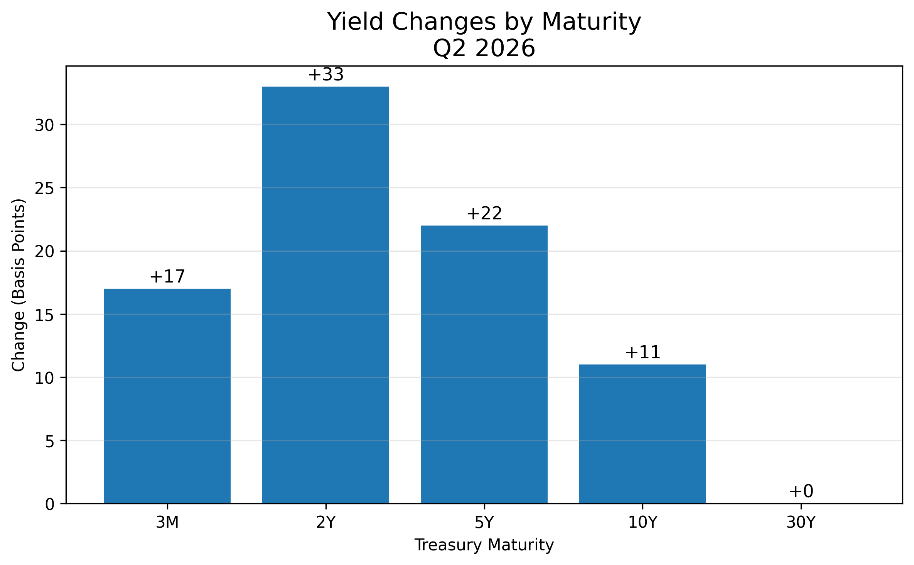

# Markets Mondays: Q2 2026 U.S. Treasury Yield Curve Review

## Overview

This project analyzes the evolution of the U.S. Treasury yield curve during **Q2 2026**, covering the period from **April 1 through June 30, 2026**.

The goal is to examine how yields changed across maturities, determine whether the curve steepened or flattened, identify the dominant statistical factors driving the market, and connect those changes to major macroeconomic events.

The project combines yield-curve visualization, spread analysis, rolling volatility, Principal Component Analysis, and an event study using daily U.S. Treasury data from the Federal Reserve Economic Data database.



## Research Questions

- How did Treasury yields change across maturities during Q2 2026?
- Did the Treasury yield curve steepen or flatten?
- Which maturities experienced the greatest repricing?
- How did interest-rate volatility evolve?
- What factors explained movements in the curve?
- How did selected FOMC decisions and CPI releases coincide with Treasury-market changes?

## Data

- Source: Federal Reserve Economic Data
- Frequency: Daily
- Sample: April 1–June 30, 2026
- Maturities:
  - 3-month
  - 2-year
  - 5-year
  - 10-year
  - 30-year

## Methodology

The analysis includes:

1. Treasury yield time-series analysis
2. Beginning-versus-end yield-curve comparison
3. Yield changes by maturity
4. 2Y–10Y spread analysis
5. 20-day rolling volatility
6. Principal Component Analysis
7. Level, Slope, and Curvature interpretation
8. Macroeconomic event-response analysis

## Key Findings

- The 2-year Treasury yield rose **33 basis points**, the largest increase across the maturities studied.
- The 5-year yield increased **22 basis points**.
- The 10-year yield rose **11 basis points**.
- The 30-year yield ended the quarter unchanged.
- The 2Y–10Y spread narrowed from **52 basis points to 30 basis points**, representing a **22-basis-point flattening**.
- The first two principal components explained **98.96%** of total yield-curve variation.
- The component loadings were consistent with the traditional **Level** and **Slope** factors.
- The selected Federal Reserve policy decisions produced the largest one-day front-end yield responses.

## Repository Structure

```text
charts/      Exported research figures
data/        Treasury-yield dataset
notebook/    Full Python analysis
report/      PDF research report
```

## Tools

- Python
- Pandas
- NumPy
- Matplotlib
- Scikit-learn
- FRED data

## Limitations

The project covers one quarter of daily observations. Event-day movements represent associations and should not be interpreted as definitive causal estimates because Treasury yields may respond to several developments simultaneously.

## Author

**Ian Chigada**  
Quantitative Macro & Rates Research

*Markets Mondays is an ongoing research series using Python to examine macroeconomic and fixed-income topics through data rather than headlines.*
